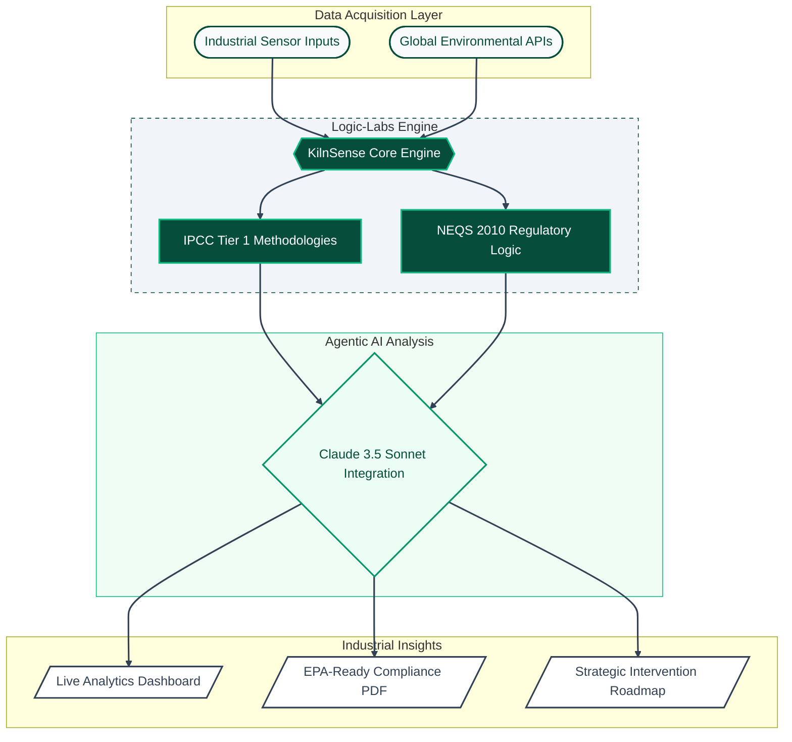

# KilnSense | AI-Powered ESG Compliance

> **Engineering a Sustainable Future for Pakistan’s Industrial Landscape.**

KilnSense is an enterprise-grade web application engineered to calculate, monitor, and mitigate industrial emissions from brick kilns. By integrating real-time air quality data, IPCC Tier 1 scientific calculation models, and advanced AI-driven recommendations, KilnSense bridges the gap between industrial operations and environmental compliance (Pakistan NEQS 2010).

---

## 🚀 Core Architecture

This application is built for high performance, strict typing, and seamless user experience:
* **Framework:** Next.js 14 (App Router)
* **Language:** TypeScript
* **Styling:** Tailwind CSS
* **Animations:** Framer Motion
* **Data Visualization:** Recharts
* **PDF Generation:** React-PDF
* **AI Engine:** Anthropic Claude API
* **Environmental APIs:** Carbon Interface, OpenAQ, Climatiq

## 📂 Project Structure & Handoff Protocols

Our development is strictly modular. Every feature is isolated in its respective file to ensure zero merge conflicts during parallel development. 

* `/app`: Next.js routing, pages, and backend API routes.
* `/components`: Isolated UI components (Layout, Dashboard, Chat, Calculator, Shared UI).
* `/lib`: Core backend logic, API wrappers, and the IPCC emission calculator engine.
* `/data`: Static JSON knowledge bases (NEQS standards, IPCC factors, Interventions).
* `/types`: TypeScript interfaces for strict data enforcement.

---

## ⚖️ Regulatory Alignment
KilnSense is built to align with the **Pakistan NEQS 2010** standards, providing kilns with:
1. Real-time compliance status (Compliant/Near-Limit/Violation).
2. ROI-based intervention roadmaps.
3. Automated EPA-Ready PDF Reporting.

---
*Developed for the 2026 Environmental Tech Hackathon by **Engr. Syed Saad Bin Irfan***
